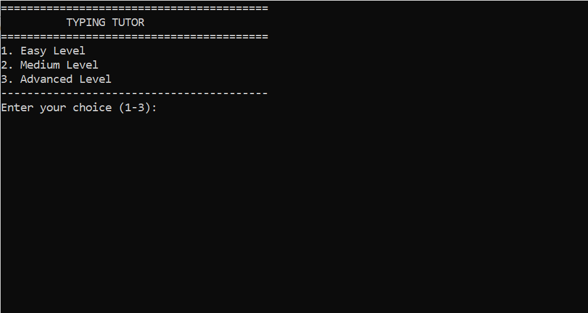
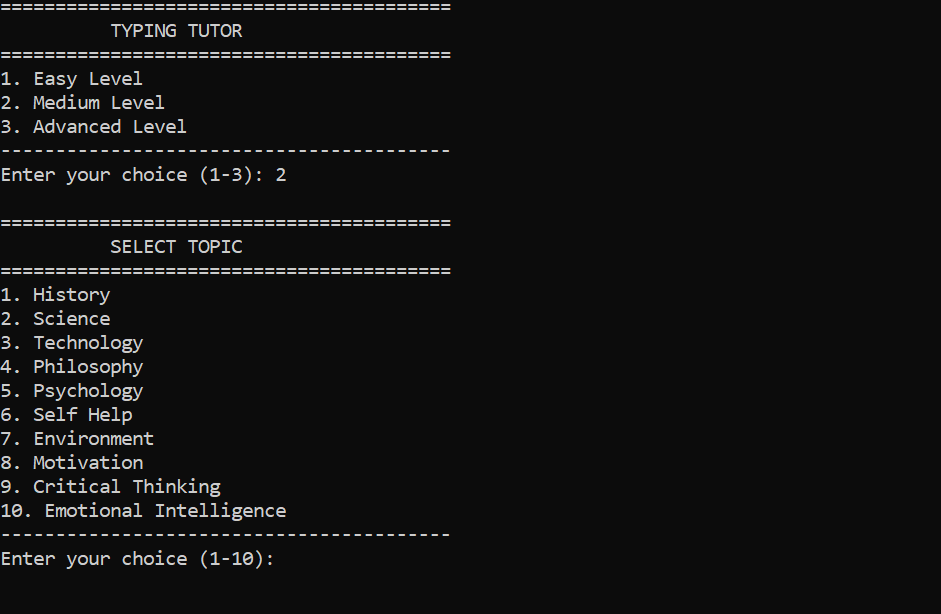
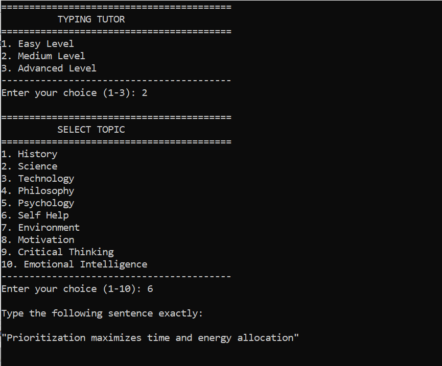
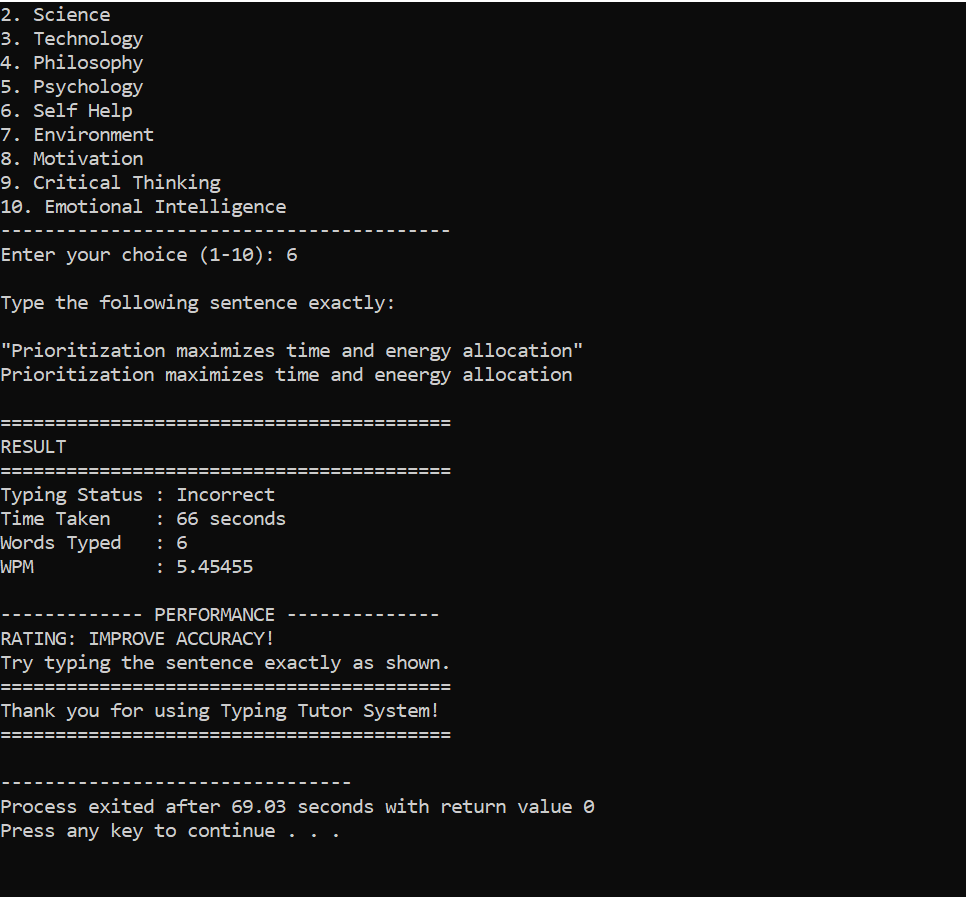

# ⌨️ Typing Tutor System

**A powerful C++ console-based typing tutor** that helps users improve typing speed and accuracy while learning from 10 educational topics.


## 📖 About

The **Typing Tutor System** is an educational C++ project developed to enhance typing skills through engaging and informative content. It offers **600+ sentences** across **10 diverse topics** and **3 difficulty levels**.

### 🎯 Purpose
- Improve typing speed (WPM)
- Enhance typing accuracy
- Learn new vocabulary across 10 topics
- Practice keyboard skills in a fun way

### 👩‍💻 Developed By
**Ameera Iqbal**  
BS Information Technology (2nd Semester)  
University of Management and Technology (UMT)  
**Date:** July 2026

---

## ✨ Features

- ✅ **10 Rich Educational Topics** (History, Science, Technology, etc.)
- ✅ **3 Progressive Difficulty Levels** (Easy, Medium, Advanced)
- ✅ **Real-time WPM Calculation** (Words Per Minute)
- ✅ **Accuracy Verification** (Exact match checking)
- ✅ **Random Sentence Selection** (600+ sentences for replayability)
- ✅ **Instant Performance Feedback** (EXCELLENT, GOOD, NOT BAD, KEEP PRACTICING)
- ✅ **Clean Console Interface** (User-friendly menus)
- ✅ **Time Tracking** (Measures typing speed accurately)

---

## 📚 Topics

| No. | Topic | Description |
|-----|-------|-------------|
| 1 | History | Historical events, empires, and leaders |
| 2 | Science | Scientific concepts, discoveries, and theories |
| 3 | Technology | Programming, digital world, and innovation |
| 4 | Philosophy | Philosophical concepts and famous thinkers |
| 5 | Psychology | Human behavior, cognition, and emotions |
| 6 | Self Help | Personal development and wellness |
| 7 | Environment | Ecology, climate, and sustainability |
| 8 | Motivation | Inspirational quotes and success principles |
| 9 | Critical Thinking | Logic, reasoning, and problem-solving |
| 10 | Emotional Intelligence | Emotional awareness and social skills |

---

## 🎯 Difficulty Levels

| Level | Description | Sentence Length | Words |
|-------|-------------|-----------------|-------|
| **Easy** 🟢 | Short, beginner-friendly sentences | 5-8 words | Simple vocabulary |
| **Medium** 🟡 | Balanced length and complexity | 8-12 words | Moderate vocabulary |
| **Advanced** 🔴 | Long, academic-level sentences | 12-18 words | Complex vocabulary |

---

## 🎥 Demo

### 1️⃣ Main Menu


### 2️⃣ Topic Selection


### 3️⃣ Typing Test


### 4️⃣ Results Screen


### Sample Output

---

## 🚀 How to Run

### Prerequisites
- C++ Compiler (g++ recommended)

### Installation

```bash
# Clone the repository
git clone https://github.com/Ameeralqbal/typing-tutor-system.git

# Navigate to folder
cd typing-tutor-system

# Compile
g++ "TYPING TUTOR SYSTEM PROJECT.cpp" -o typing_tutor

# Run
./typing_tutor          # Linux/macOS
typing_tutor.exe        # Windows
