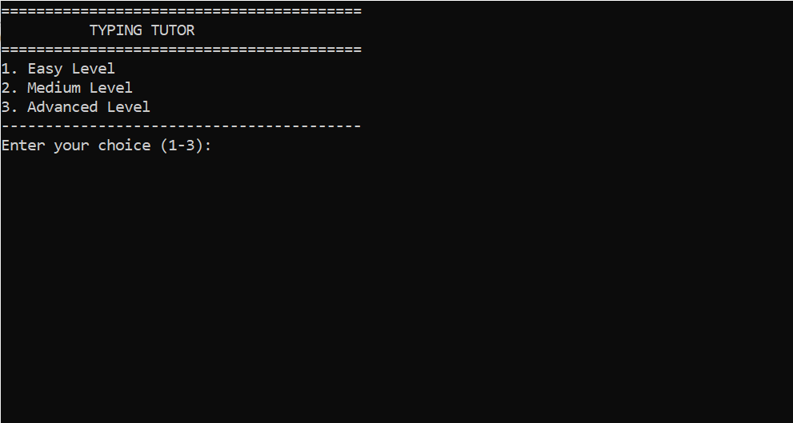
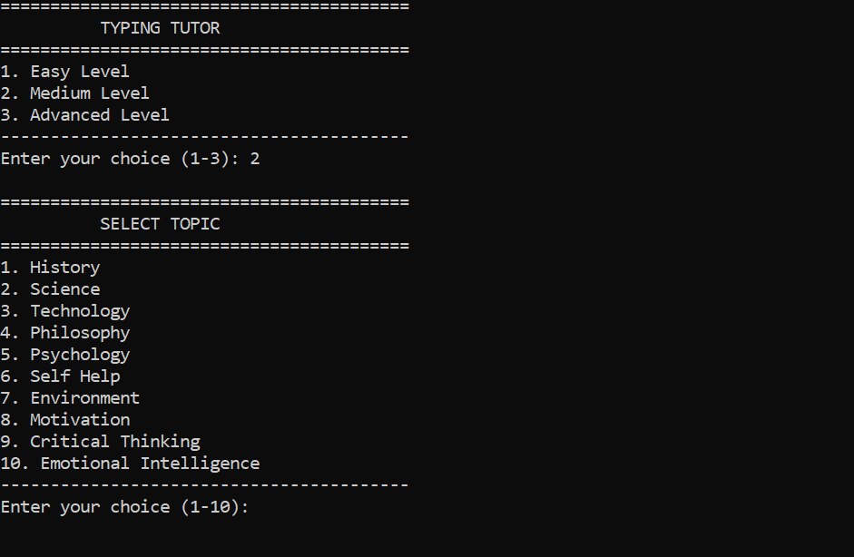
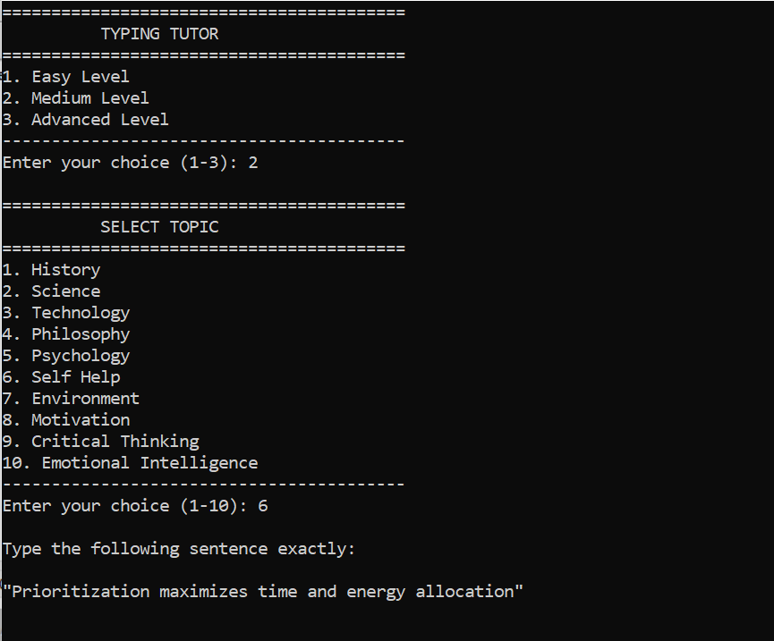
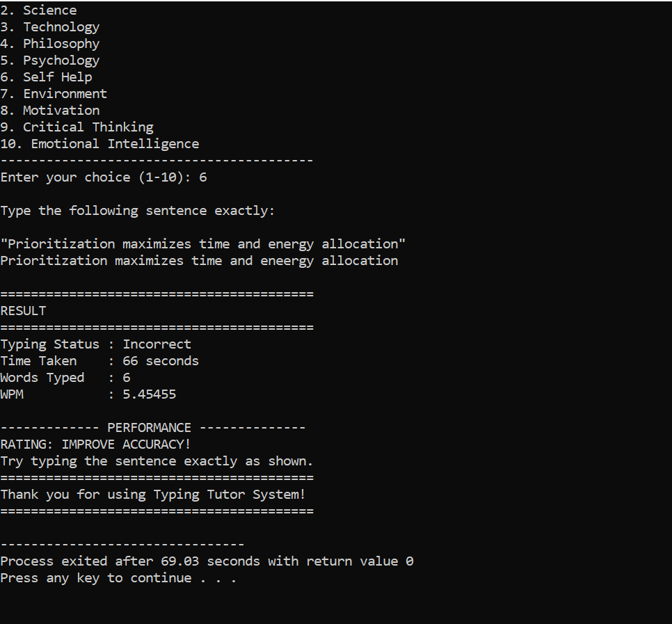

# ⌨️ Typing Tutor System

**A powerful C++ console-based typing tutor** that helps users improve typing speed and accuracy while learning from 10 educational topics.


## 📖 About

The **Typing Tutor System** is an educational C++ project developed to enhance typing skills through engaging and informative content. It offers **600+ sentences** across **10 diverse topics** and **3 difficulty levels**.

### 🎯 Purpose
- Improve typing speed (WPM)
- Enhance typing accuracy
- Learn new vocabulary across 10 topics
- Practice keyboard skills in a fun way


## ✨ Features

- ✅ **10 Rich Educational Topics** (History, Science, Technology, etc.)
- ✅ **3 Progressive Difficulty Levels** (Easy, Medium, Advanced)
- ✅ **Real-time WPM Calculation** (Words Per Minute)
- ✅ **Accuracy Verification** (Exact match checking)
- ✅ **Random Sentence Selection** (600+ sentences for replayability)
- ✅ **Instant Performance Feedback** (EXCELLENT, GOOD, NOT BAD, KEEP PRACTICING)
- ✅ **Clean Console Interface** (User-friendly menus)
- ✅ **Time Tracking** (Measures typing speed accurately)


## 📚 Topics

| No. | Topic | Description |
|-----|-------|-------------|
| 1 | History | Historical events, empires, and leaders |
| 2 | Science | Scientific concepts, discoveries, and theories |
| 3 | Technology | Programming, digital world, and innovation |
| 4 | Philosophy | Philosophical concepts and famous thinkers |
| 5 | Psychology | Human behavior, cognition, and emotions |
| 6 | Self Help | Personal development and wellness |
| 7 | Environment | Ecology, climate, and sustainability |
| 8 | Motivation | Inspirational quotes and success principles |
| 9 | Critical Thinking | Logic, reasoning, and problem-solving |
| 10 | Emotional Intelligence | Emotional awareness and social skills |


## 🎯 Difficulty Levels

| Level | Description | Sentence Length | Words |
|-------|-------------|-----------------|-------|
| **Easy** 🟢 | Short, beginner-friendly sentences | 5-8 words | Simple vocabulary |
| **Medium** 🟡 | Balanced length and complexity | 8-12 words | Moderate vocabulary |
| **Advanced** 🔴 | Long, academic-level sentences | 12-18 words | Complex vocabulary |
### 1️⃣ Main Menu

<p align="center">
  
</p>

### 2️⃣ Topic Selection

<p align="center">
  
</p>

### 3️⃣ Typing Test

<p align="center">
  
</p>

### 4️⃣ Results Screen

<p align="center">
  
</p>


## 🚀 How to Run

```bash
g++ "TYPING TUTOR SYSTEM PROJECT.cpp" -o typing_tutor
./typing_tutor
```

> **Windows:** Run `typing_tutor.exe` after compiling.
## Future Enhancements

- 🎯 User Profiles - Save typing history and track progress over time
- 🎨 GUI Interface - Replace console with graphical interface
- 📝 More Sentences - Add 50+ sentences per difficulty level
- ✏️ Custom Sentences - Allow users to add their own sentences
- ⏱️ Time-based Mode - Challenge users to type as many words as possible
- 🏆 Leaderboard - Compare scores with other users
- 📊 Export Reports - Generate PDF reports of performance
- 📱 Mobile App - Create Android/iOS version
## 👩‍💻 Author

**Ameera Iqbal**

BS Information Technology Student

- GitHub: https://github.com/AmeeraIqbal
- LinkedIn: www.linkedin.com/in/ameera-iqbal-31b179419

Keep practicing and happy typing! ⌨️
